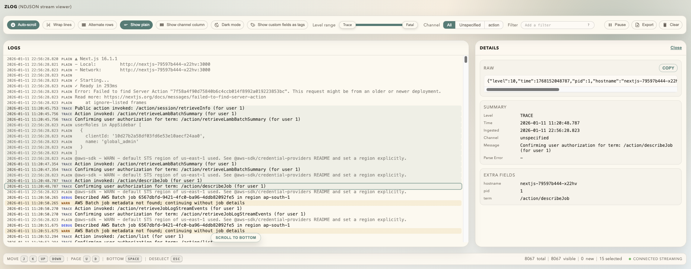

# zlog

A lightweight CLI tool with a browser-based UI for streaming and analyzing newline-delimited JSON (NDJSON) logs in real time.



## Why zlog?

When debugging services that output structured JSON logs (kubernetes pods, Docker containers, or local processes), you often need more than `grep` or `jq` can provide in a streaming context. zlog bridges the gap between simple text filtering and heavy log aggregation platforms: it's a single binary that gives you instant visual feedback, powerful filtering, and an interactive interface without requiring infrastructure setup or cloud accounts.

## Key Features

- **Zero Dependencies**: Single Go binary, no installation required—just pipe your logs to it
- **Real-Time Streaming**: Server-Sent Events (SSE) keep logs flowing smoothly without polling
- **Advanced Filtering**: JQ-style path expressions with operators (==, !=, contains, regex) that persist across sessions
- **Interactive Selection**: Click, shift-click, and keyboard navigation to select and export specific log entries
- **Live UI Controls**: Toggle between light/dark themes, wrap lines, show/hide channels, display custom fields as tags—all without page reloads
- **Keyboard-First**: Navigate with j/k/arrows, jump to bottom with space, deselect with ESC
- **Performance-Optimized**: Handles near infinite entries with incremental DOM updates, debounced filters, and CSS containment for smooth typing
- **Local and Persistent**: All preferences stored in browser localStorage

## Installation

### Homebrew (macOS/Linux)
```bash
brew install w9/zlog/zlog
```

### Go Install
```bash
go install github.com/w9/zlog@latest
```

### Pre-built Binaries

Download from [GitHub Releases](https://github.com/w9/zlog/releases/latest):

**Linux:**
```bash
# AMD64
curl -L https://github.com/w9/zlog/releases/download/v0.3.0/zlog-linux-amd64 -o zlog
chmod +x zlog
sudo mv zlog /usr/local/bin/

# ARM64
curl -L https://github.com/w9/zlog/releases/download/v0.3.0/zlog-linux-arm64 -o zlog
chmod +x zlog
sudo mv zlog /usr/local/bin/
```

**macOS:**
```bash
# Intel
curl -L https://github.com/w9/zlog/releases/download/v0.3.0/zlog-darwin-amd64 -o zlog
chmod +x zlog
sudo mv zlog /usr/local/bin/

# Apple Silicon
curl -L https://github.com/w9/zlog/releases/download/v0.3.0/zlog-darwin-arm64 -o zlog
chmod +x zlog
sudo mv zlog /usr/local/bin/
```

**Windows:**

Download [zlog-windows-amd64.exe](https://github.com/w9/zlog/releases/download/v0.3.0/zlog-windows-amd64.exe) or [zlog-windows-arm64.exe](https://github.com/w9/zlog/releases/download/v0.3.0/zlog-windows-arm64.exe) and add to your PATH.

### From Source
```bash
git clone https://github.com/w9/zlog.git
cd zlog
go build -o zlog
sudo mv zlog /usr/local/bin/  # Optional: install globally
```

## Quick Start

Pipe logs from kubectl:

```bash
kubectl logs my-pod -f | zlog
```

Or use with any NDJSON source:

```bash
docker logs my-container --follow | zlog
cat application.log | zlog
```

Then open **http://localhost:8037** in your browser.

## Local Development

Test with a sample log file:

```bash
cat log.txt | go run .
```

Simulate a live stream with variable delays:

```bash
./scripts/feed-log.sh --file log.txt --min 0.1 --max 2 --burst 25 | go run .
```

## Command-Line Flags

| Flag        | Default       | Description                                       |
|-------------|---------------|---------------------------------------------------|
| `--host`    | `127.0.0.1`   | Server bind address                               |
| `--port`    | `8037`        | HTTP port                                         |
| `--max`     | `10000`       | Maximum log entries kept in memory (ring buffer)  |
| `--filter`  | _none_        | Add a filter expression (repeatable)              |
| `--channel` | _none_        | Shorthand for `.channel = <value>` (repeatable)   |

## Filter Syntax

Filters combine with AND logic and persist across page reloads via localStorage.

**Message Contains** (plain text, no leading dot):
```
timeout
error connecting
```

**Regex on Message**:
```
/^aws/i
/timeout|error/
```

**JQ-Style Path Filters**:
```
.level == "error"                  # exact match
.channel == "api"                  # check channel field
.session                           # field exists
.duration >= 120                   # numeric comparison
.message contains "timeout"        # substring search
.user.name startswith "admin"      # nested path
.tags[0] == "critical"             # array index
```

**Supported Operators**: `=`, `==`, `!=`, `<`, `>`, `<=`, `>=`, `contains`, `startswith`, `endswith`

## User Interface

### Toolbar Features

- **Auto-scroll**: Keeps view locked to latest log (disables when you scroll up)
- **Wrap lines**: Toggle between truncated and wrapped log messages
- **Alternate rows**: Zebra striping for easier scanning
- **Show plain logs**: Include/exclude unparsed text lines
- **Show channel column**: Display an optional channel field from your logs
- **Dark mode**: Switches between light and dark themes (follows system preference by default)
- **Show tags**: Display custom JSON fields as inline tags on each row
- **Level range**: Filter by severity (trace, debug, info, warn, error, fatal)
- **Channel selector**: Filter by specific channel values
- **Filter input**: Add complex filters with inline help tooltip
- **Pause/Export/Clear**: Control buttons for stream management

### Details Panel

Click any log row to open a side panel showing:
- **Summary**: Timestamp, level, channel, message
- **Custom Fields**: All extra JSON fields in an organized table
- **Raw JSON**: Complete original log line with copy button

### Keyboard Shortcuts

| Key             | Action                          |
|-----------------|---------------------------------|
| `j` / `↓`       | Select next log                 |
| `k` / `↑`       | Select previous log             |
| `u` / `Page Up` | Scroll up one page              |
| `d` / `Page Down` | Scroll down one page          |
| `Space`         | Jump to bottom                  |
| `ESC`           | Deselect all and close details  |

### Status Bar

Displays real-time information:
- **Total logs**: All entries in memory
- **Visible logs**: Entries matching current filters
- **New logs**: Unread entries (when scrolled up or paused)
- **Selected count**: Number of logs selected (when any are selected)
- **Connection status**: Streaming, reconnecting, or error states

## Export Functionality

- **With Selection**: Click rows to select (shift-click for ranges), then Export exports only selected logs
- **Without Selection**: Export button exports all visible logs (with confirmation if >1000)
- **Format**: Exports as NDJSON (`.jsonl`) file with timestamp in filename

## Architecture

### Backend (Go)

- Reads NDJSON from stdin line-by-line with a 10MB scanner buffer for long lines
- Parses each line as JSON or falls back to plain text with parse error tracking
- Maintains a ring buffer of entries (default 10,000) to prevent memory overflow
- Serves logs via `/logs` endpoint (initial state) and `/events` SSE endpoint (streaming)
- Embeds static assets (HTML/CSS/JS) so binary is fully self-contained

### Frontend (JavaScript)

- **Vanilla JS**: No frameworks, ~2,400 lines, 60KB uncompressed
- **EventSource API**: Efficient server-sent events for real-time updates
- **Incremental Rendering**: Appends new rows when filters unchanged, full re-render only on state changes
- **DocumentFragment Batching**: Minimizes layout thrash when building large DOM updates
- **Debounced Inputs**: 150ms delay on filter typing prevents expensive re-renders
- **CSS Containment**: Isolates expensive layout calculations (fixes Edge typing lag)
- **Smart Auto-Scroll**: New logs don't steal scroll position when reviewing older entries

## Performance Characteristics

- **Memory**: Bounded by `--max` flag (default 10k entries ~5-10MB depending on log size)
- **CPU**: Minimal—streaming uses SSE, no polling; filter updates are debounced
- **DOM Size**: Matches visible entry count; large lists use virtual scrolling patterns via CSS containment
- **Network**: Single HTTP connection for page load + one persistent SSE stream
- **Latency**: Sub-100ms from log line to browser display under normal conditions

## Browser Compatibility

- Modern browsers with EventSource support (Chrome, Firefox, Safari, Edge)
- Tested on:
  - Chrome/Edge 90+
  - Firefox 88+
  - Safari 14+

## License

MIT

## Contributing

Issues and pull requests welcome. When reporting bugs, include:
- Browser and OS versions
- Log volume and structure
- Steps to reproduce

## Acknowledgments

- Filter syntax inspired by jq
- UI design patterns from modern log viewers and developer tools
- Material Design Icons for toolbar buttons

## Authors

Xun Zhu (zhuxun2@gmail.com)